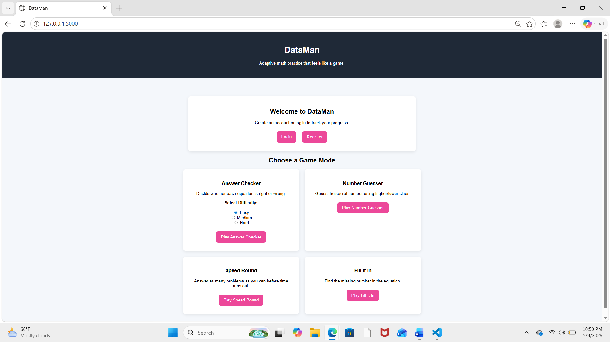
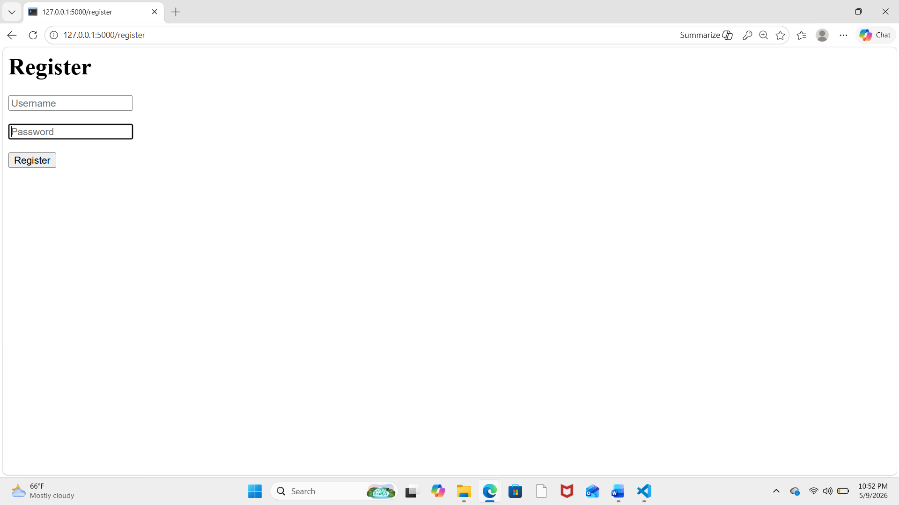
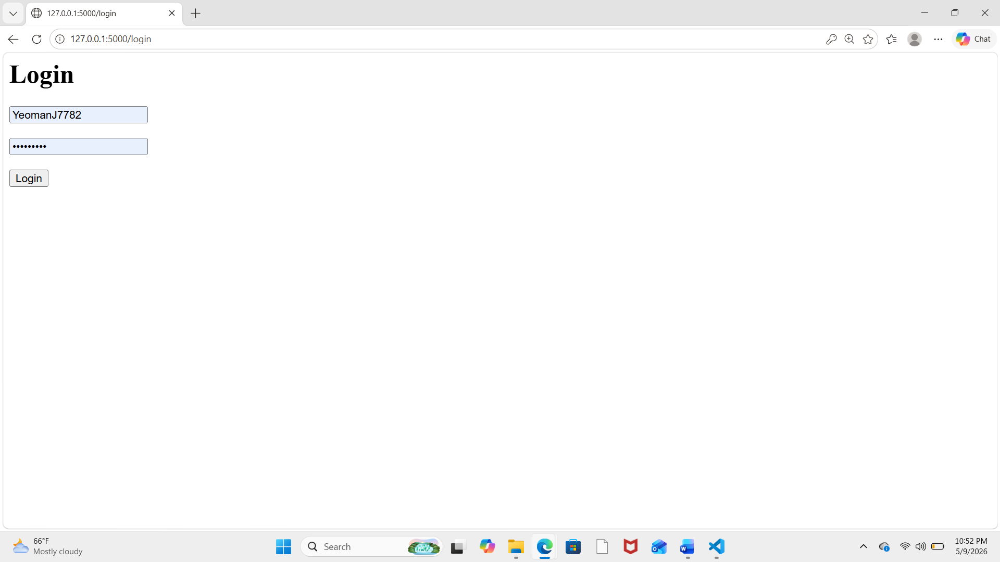
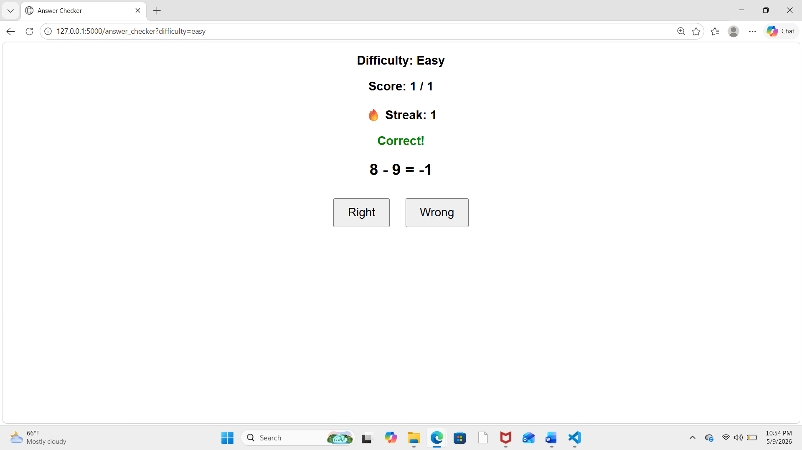
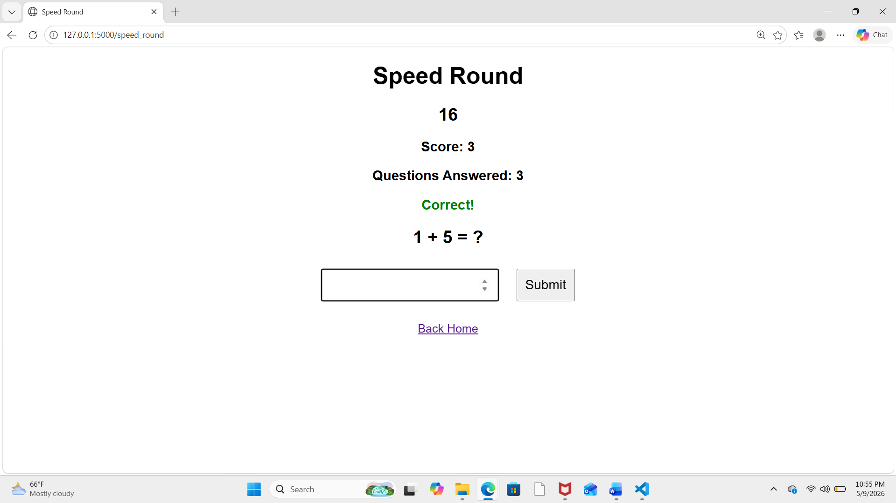
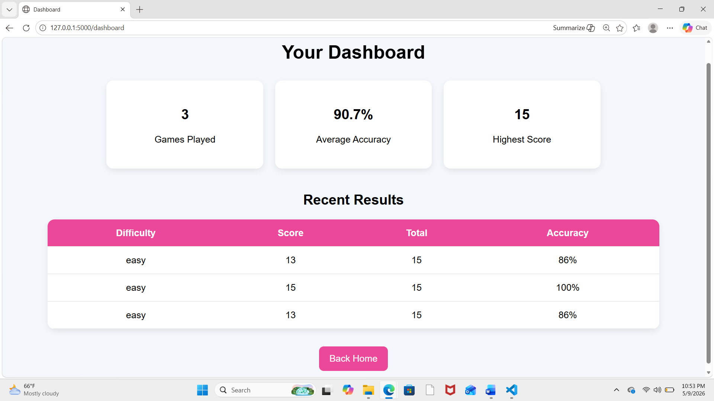

# CSC 289 — Capstone Project Binder

# DataMan

## Cover Page

**Project Name:** DataMan
**Course:** CSC 289 — Programming Capstone
**Semester:** Spring 2026
**Student:** Julie Yeoman
**Repository URL:** [https://github.com/YeomanJ7782/Dataman](https://github.com/YeomanJ7782/Dataman)
**Final Submission Date:** May 2026

---

# Table of Contents

1. Project Overview
2. Team Roster & Roles
3. Product Vision
4. User Stories
5. System Architecture
6. Data Model
7. Key Features & Implementation Notes
8. Deployment
9. Lessons Learned & Retrospective
10. Appendices

---

# 1. Project Overview



DataMan is a Flask-based educational math game web application designed to make practicing math interactive and engaging. Users can register for accounts, log in securely, play multiple game modes, and track their performance over time through a personalized dashboard.

The application is intended for students and casual learners who want a more engaging way to practice foundational math skills. Instead of static worksheets or repetitive drills, DataMan introduces game mechanics such as timed rounds, score tracking, streak systems, and multiple gameplay styles.

The primary problem the application solves is student disengagement during repetitive math practice. Many learners lose motivation when educational tools feel overly formal or repetitive. DataMan addresses this by combining educational content with lightweight gaming mechanics.

The current application includes:

* User registration and authentication
* Multiple playable math game modes
* Database persistence using SQLite
* Dashboard analytics and score tracking
* Difficulty selection
* Session tracking and timed gameplay
* Responsive and polished user interface

The application is fully functional locally and can be expanded in the future with additional game modes, leaderboards, AI-generated questions, and deployment to a public hosting platform.

---

# 2. Team Roster & Roles

| Name         | Role                 | GitHub Username | Contribution                                                         |
| ------------ | -------------------- | --------------- | -------------------------------------------------------------------- |
| Julie Yeoman | Full Stack Developer | YeomanJ7782     | Designed, implemented, tested, and documented the entire application |

Although the original project structure anticipated group collaboration, the majority of implementation, integration, debugging, documentation, and testing work was completed independently.

---

# 3. Product Vision

## 3a. Target Users / Personas

### Persona 1 — Ethan, Elementary Student

Ethan is a 10-year-old elementary school student who enjoys video games but becomes frustrated with repetitive math worksheets. He learns best through interactive activities that provide immediate feedback and rewards. Traditional homework often causes Ethan to lose focus quickly, especially when assignments feel repetitive or disconnected from activities he enjoys.

DataMan provides Ethan with a more engaging way to practice arithmetic skills through game mechanics such as score tracking, streak systems, and timed challenges. Features like Answer Checker and Speed Round help maintain his attention by turning practice into a more interactive experience. The multiple game modes also help reduce repetition and encourage replayability.

Ethan represents younger learners who benefit from educational tools that combine entertainment with skill development.

---

### Persona 2 — Maria, Busy Parent

Maria is a working parent with limited time to supervise daily homework sessions. She wants educational tools that are easy for her child to use independently while still providing meaningful learning opportunities. Maria values applications that are simple to navigate, visually approachable, and capable of tracking progress over time.

DataMan supports Maria by providing an accessible browser-based learning tool with account-based score tracking and dashboard analytics. The dashboard allows progress to be monitored without requiring extensive setup or technical knowledge.

Maria also appreciates that the application focuses on short gameplay sessions. Features such as Speed Round allow children to practice math in smaller, more manageable periods of time rather than requiring long study sessions.

### Persona 3 — Jordan, Casual Learner

Jordan is an adult learner preparing to return to college after several years away from formal education. Jordan wants a lightweight and approachable way to refresh basic arithmetic skills before taking placement exams or introductory college courses.

Many educational applications designed for younger audiences feel overly childish or overwhelming to adult learners. DataMan provides Jordan with a cleaner and simpler interface that focuses directly on skill practice without unnecessary complexity.

The variety of game modes allows Jordan to practice in multiple ways depending on learning preference. Answer Checker provides quick recognition-based review, while Fill It In encourages more active problem solving and mental calculation.

Jordan represents nontraditional learners who need flexible educational tools that feel approachable and low-pressure.

---

## 3b. Core Value Proposition

DataMan combines educational math practice with lightweight gaming mechanics to create a more engaging learning experience. The application offers multiple gameplay styles, score tracking, and performance analytics in a clean and approachable interface.

Unlike traditional worksheets, DataMan introduces:

* Timed gameplay
* Streak systems
* Interactive guessing mechanics
* Performance dashboards
* Multiple game modes

These features encourage repeated use and improve user engagement.

---

## 3c. Feature Scope

| Feature                | Status      |
| ---------------------- | ----------- |
| User Registration      | Implemented |
| User Login/Logout      | Implemented |
| Answer Checker         | Implemented |
| Number Guesser         | Implemented |
| Speed Round            | Implemented |
| Fill It In             | Implemented |
| Dashboard Analytics    | Implemented |
| Score Persistence      | Implemented |
| Adaptive Difficulty    | Implemented |
| Leaderboards           | Planned     |
| AI-generated Questions | Planned     |
| Public Deployment      | Planned     |

---

# 4. User Stories

### Sprint 1 — Core Authentication & Gameplay

- As a user, I want to create an account so that my game progress can be saved between sessions.  
**Status:** Done

- As a user, I want to log into my account so that I can access my personalized dashboard.  
**Status:** Done

- As a user, I want to log out securely so that other users cannot access my account on a shared device.  
**Status:** Done

- As a user, I want to immediately know whether my answer is correct so that I can learn from mistakes quickly.  
**Status:** Done

---

### Sprint 2 — Expanded Gameplay Features

- As a user, I want multiple game modes so that practicing math feels less repetitive.  
**Status:** Done

- As a user, I want different difficulty levels so that I can choose a challenge appropriate for my skill level.  
**Status:** Done

- As a user, I want a timed game mode so that I can challenge myself to think faster.  
**Status:** Done

- As a user, I want streak tracking so that I feel rewarded for answering correctly multiple times in a row.  
**Status:** Done

- As a user, I want randomized questions so that the game stays fresh when replayed multiple times.  
**Status:** Done

---

### Sprint 3 — Analytics & Polish

- As a user, I want my scores saved automatically so that I can track my improvement over time.  
**Status:** Done

- As a user, I want a dashboard showing my statistics so that I can monitor my performance.  
**Status:** Done

- As a user, I want a clean and visually appealing interface so that the application feels easy and enjoyable to use.  
**Status:** Done

- As a user, I want navigation links between pages so that I can move easily between games and the dashboard.  
**Status:** Done

---

### Future / Planned Stories

- As a user, I want a leaderboard so that I can compare my scores against other players.  
**Status:** Planned

- As a user, I want adaptive AI-generated questions so that the game adjusts to my skill level automatically.  
**Status:** Planned

- As a user, I want a publicly hosted version of the application so that I can access it from any device.  
**Status:** Planned

---

# 5. System Architecture

## 5a. Tech Stack

| Technology       | Purpose                                    |
| ---------------- | ------------------------------------------ |
| Python           | Primary programming language               |
| Flask            | Web application framework                  |
| Flask-SQLAlchemy | ORM for database management                |
| SQLite           | Local database storage                     |
| HTML/CSS         | Frontend layout and styling                |
| Jinja2           | Dynamic template rendering                 |
| Git/GitHub       | Version control and collaboration workflow |

---

## 5b. Application Structure

The application follows a standard Flask architecture.

* Routes are defined in `app.py`
* HTML templates are stored in the `templates/` directory
* SQLite database models are managed using SQLAlchemy
* Session management handles authentication and gameplay state
* Jinja2 templates dynamically render game content and statistics

### Simplified Structure

```text
Dataman/
│
├── app.py
├── templates/
├── instance/
├── README.md
├── CLAUDE.md
└── .gitignore
```

---

## 5c. Route Map

| Route           | Method    | Description              | Auth Required |
| --------------- | --------- | ------------------------ | ------------- |
| /               | GET       | Homepage                 | No            |
| /register       | GET, POST | User registration        | No            |
| /login          | GET, POST | User login               | No            |
| /logout         | GET       | User logout              | Yes           |
| /answer_checker | GET, POST | Main math game           | No            |
| /number_guesser | GET, POST | Number guessing game     | No            |
| /speed_round    | GET, POST | Timed math challenge     | No            |
| /fill_it_in     | GET, POST | Missing number game      | No            |
| /dashboard      | GET       | User analytics dashboard | Yes           |

---

# 6. Data Model

## 6a. Entity Relationship Diagram

### Simplified ERD

```text
User
----
id
username
password

GameResult
----------
id
username
score
total
accuracy
difficulty
```

---

## 6b. Data Dictionary

### User Table

| Column   | Type    | Constraints      | Description            |
| -------- | ------- | ---------------- | ---------------------- |
| id       | Integer | PK               | Unique user identifier |
| username | String  | Unique, Not Null | User login name        |
| password | String  | Not Null         | User password          |

### GameResult Table

| Column     | Type    | Constraints | Description               |
| ---------- | ------- | ----------- | ------------------------- |
| id         | Integer | PK          | Unique result identifier  |
| username   | String  | Not Null    | Username tied to score    |
| score      | Integer | Not Null    | Correct answers           |
| total      | Integer | Not Null    | Total questions           |
| accuracy   | Integer | Not Null    | Accuracy percentage       |
| difficulty | String  | Not Null    | Selected difficulty level |

---

## 6c. Key Relationships

The GameResult table stores gameplay statistics connected to individual usernames. This allows the application to display historical statistics and analytics on the dashboard.

Each user can generate multiple game results over time, creating a one-to-many relationship conceptually between users and saved game sessions.

---

# 7. Key Features & Implementation Notes

## Feature 1 — User Authentication






### What it does

Users can register accounts, log in, and log out securely.The authentication system was designed to provide persistent user sessions across the application. After a successful login, the application stores the authenticated username inside the Flask session object. This allows protected routes such as the dashboard to verify whether a user is logged in before granting access.

The registration system uses SQLAlchemy to create and store new users inside the SQLite database. Usernames are required to be unique in order to prevent duplicate accounts. Authentication queries compare submitted credentials against stored database records.

The authentication feature also became important for score tracking because saved game results are associated with the currently logged-in user. Without authentication, the dashboard system would not be able to provide personalized analytics or persistent score history.

### How it works

Flask session management stores the logged-in username after authentication. SQLAlchemy handles user persistence inside the SQLite database.

### Challenges encountered

Managing sessions correctly was initially difficult because clearing session data after games accidentally logged users out. Initially, the application used session.clear() at the end of games to reset score data. However, this also removed the authenticated user's login session, causing users to unexpectedly return to the homepage as guests after finishing gameplay. Debugging this issue required tracing which session variables were responsible for authentication versus gameplay state.

The issue was resolved by replacing session.clear() with selective session cleanup using session.pop(). This allowed gameplay variables such as score, streak, and question state to reset without removing the logged-in user. This debugging process improved understanding of Flask session management and the importance of separating authentication data from temporary gameplay data.

Another challenge involved ensuring authentication routes and redirects behaved correctly after login and logout events. Several route-testing passes were needed to confirm users could reliably navigate between game modes, the dashboard, and the homepage without session conflicts.

---

## Feature 2 — Answer Checker Game



### What it does

Users determine whether generated math equations are correct or incorrect. The Answer Checker game serves as the core gameplay mode of the application. The feature dynamically generates arithmetic equations using randomly selected operators and values. Users must determine whether the displayed equation is mathematically correct.

Difficulty selection changes the maximum random number range used during equation generation. Easy mode uses smaller values while Hard mode introduces larger values and more complex multiplication problems.

The game also tracks user streaks, total questions answered, and score accuracy. These statistics are stored in Flask sessions during gameplay and later saved to the database when the game ends.

A major design goal for this feature was maintaining fast gameplay flow while still preserving variety. Randomized question generation allows users to replay the game repeatedly without encountering the same sequence of problems.

### How it works

Random numbers and operators are generated dynamically. The application stores the correct answer in the session and compares it against the user's choice.

### Challenges encountered

One challenge was balancing difficulty levels while still keeping the game fun and responsive. Early versions of the game generated equations that were either too repetitive or too difficult too quickly. Adjustments had to be made to the number ranges and operation selection in order to create a smoother progression between Easy, Medium, and Hard difficulties.

Another challenge involved maintaining gameplay state across requests. Because Flask applications refresh on every form submission, the correct answer and question state needed to persist temporarily between requests. This required storing values inside Flask sessions and carefully testing that questions updated correctly after every answer.

Additional debugging was required to prevent issues where the displayed equation accidentally matched the correct answer too frequently. Randomization logic was adjusted several times to improve gameplay variety and ensure users could not easily predict patterns in the generated questions.

---

## Feature 3 — Speed Round



### What it does

Users answer as many questions as possible before time expires. The Speed Round feature introduces timed gameplay mechanics to increase engagement and challenge. Unlike the Answer Checker mode, users must manually type answers while racing against a countdown timer.

The timer system relies on storing a session timestamp at the beginning of gameplay. Each request recalculates elapsed time dynamically in order to preserve accurate countdown behavior across multiple page submissions.

This feature also required balancing question complexity with available time. Early versions created situations where difficult multiplication questions consumed too much of the timer. The final implementation improved pacing by carefully selecting question difficulty and maintaining fast gameplay transitions.

The Speed Round feature demonstrates session persistence, timing logic, and dynamic question generation working together simultaneously.

### How it works

The application stores a start timestamp in the session and calculates remaining time dynamically on each request.

### Challenges encountered

Initially the timer reset after each question because the timestamp was recreated repeatedly during each request cycle. Since Flask handles each request independently, the timer variable unintentionally refreshed every time the user submitted an answer. This made the game impossible to finish correctly because the countdown effectively restarted after each interaction.

The issue was resolved by initializing the timer only once at the beginning of the game session and storing the timestamp inside Flask session data. The application then calculated elapsed time dynamically during each request. This required additional testing to ensure timing remained accurate even when users refreshed the page or submitted answers quickly.

Another challenge involved balancing the timer duration against question difficulty. Early testing showed that more difficult multiplication questions significantly reduced the number of problems users could reasonably answer before time expired. The question generation logic was adjusted to create a better gameplay balance while still preserving challenge.

---

## Feature 4 — Dashboard Analytics



### What it does

Displays saved user statistics such as total games played, average accuracy, and highest score. The dashboard transforms the project from a simple collection of games into a more complete educational application. Instead of only displaying temporary gameplay results, the dashboard provides persistent historical analytics for each authenticated user.

The dashboard calculates statistics dynamically from saved database records, including:
- total games played
- highest score
- average accuracy
- historical score entries

This required integrating Flask session authentication with SQLAlchemy database queries. The dashboard route filters results based on the currently logged-in user to ensure personalized analytics.

Additional styling improvements were implemented using card-based layouts and responsive table formatting to improve readability and professionalism.

### How it works

The dashboard queries saved GameResult entries from the SQLite database and calculates summary statistics dynamically.

### Challenges encountered

Database persistence and route integration required careful testing to ensure scores saved correctly after game completion. Early implementations displayed scores properly during gameplay but failed to consistently store completed sessions inside the SQLite database.

Another challenge involved ensuring the dashboard only displayed statistics for the currently logged-in user. Queries needed to filter results using the authenticated username stored in the session. This required testing multiple accounts to confirm that one user's scores could not accidentally appear on another user's dashboard.

Calculating analytics such as average accuracy and highest score also introduced edge cases. For example, division-by-zero errors could occur if a user visited the dashboard before completing any games. Additional logic was added to safely handle empty result sets and maintain a polished user experience.

Styling the dashboard also required multiple iterations. The goal was to create a cleaner and more professional interface while still keeping the layout simple and readable. Card-based analytics panels and improved table styling were eventually implemented to improve visual organization.

---

## Feature 5 — UI Polish

### What it does

Provides a more polished and visually engaging user interface.

### How it works

CSS styling was added directly inside templates to improve layout, colors, spacing, and responsiveness. User interface polish became increasingly important as additional game modes and features were added. The goal was to create an application that felt visually organized, approachable, and engaging rather than appearing as a collection of disconnected pages.

The homepage was redesigned to act as a central navigation hub for all game modes. Card-based layouts were introduced to improve readability and make feature selection easier for users.

Consistent color palettes, spacing, hover effects, and typography were implemented throughout the application in order to create a more cohesive visual experience. Responsive layout techniques were also used to ensure the interface remained usable across different screen sizes.

Although the styling was implemented primarily with inline CSS inside templates, the project structure could easily be expanded in the future to use dedicated static CSS files for improved scalability.

### Challenges encountered

Maintaining visual consistency across multiple templates while preserving functionality required repeated testing and adjustments. Since styling was initially added incrementally during feature development, different pages began to develop inconsistent spacing, button colors, and layout structures.

Another challenge involved improving the visual appearance without breaking route functionality or form submissions. Several UI changes required testing navigation links, forms, and buttons after styling updates to ensure gameplay functionality remained intact.

The homepage redesign was especially important because it became the central navigation hub for all game modes. Considerable effort was spent improving responsiveness, card layouts, button styling, and overall organization to make the project appear more polished and professional.

The project also encountered a significant GitHub workflow challenge involving accidental inclusion of an API key inside a .env file. GitHub push protection blocked repository updates until the secret-containing commit history was removed. Resolving this issue required learning how to reset branches, recreate clean branches, and safely manage environment variables using .gitignore. This became one of the most valuable real-world workflow lessons encountered during development.

---

# 8. Deployment

The application currently runs locally using Flask's built-in development server.

## Development Environment

* Python 3
* Flask
* SQLite database
* Windows PowerShell
* VS Code

## Environment Variables

The project can optionally support environment variables for future API integrations.

## Local Deployment Steps

1. Clone the repository
2. Create a virtual environment
3. Activate the virtual environment
4. Install dependencies
5. Run `python app.py`
6. Open `http://127.0.0.1:5000`

## Future Deployment Plans

Potential hosting platforms include:

* Render
* Railway
* PythonAnywhere

Future deployment would likely involve migrating from SQLite to PostgreSQL for production scalability.

---

# 9. Lessons Learned & Retrospective

This project significantly improved my understanding of full stack web development using Flask.

The most important skills learned included:

* Flask routing and session management
* Database modeling with SQLAlchemy
* Git and GitHub workflow management
* Branching and pull request workflows
* Debugging application state issues
* Structuring multi-page web applications

One major lesson learned was the importance of incremental testing. Small issues with sessions, routes, and templates could create unexpected bugs if not tested immediately.

Another major takeaway was the importance of GitHub workflow discipline. Using feature branches, commits, and pull requests helped keep the project organized and recoverable.

If rebuilding the project in the future, I would likely:

* Separate routes into Blueprints
* Use external CSS files instead of inline styling
* Add password hashing
* Add automated tests
* Deploy the application publicly

The feature I am most proud of is the dashboard analytics system because it transformed the project from a simple game collection into a more complete educational application.

---

# 10. Appendices

## Appendix A — Repository URL

[https://github.com/YeomanJ7782/Dataman](https://github.com/YeomanJ7782/Dataman)

---

## Appendix B — CLAUDE.md

The project includes a CLAUDE.md file documenting:

* development workflow
* branching strategy
* AI assistance usage
* sprint structure
* testing process

---

## Appendix C — Screenshots

Suggested screenshots:

* Homepage
* Login page
* Dashboard
* Answer Checker
* Speed Round
* Fill It In
* Number Guesser

---

## Appendix D — Future Improvements

* Leaderboards
* AI-generated questions
* Sound effects
* Public deployment
* Dark mode
* Additional game modes
